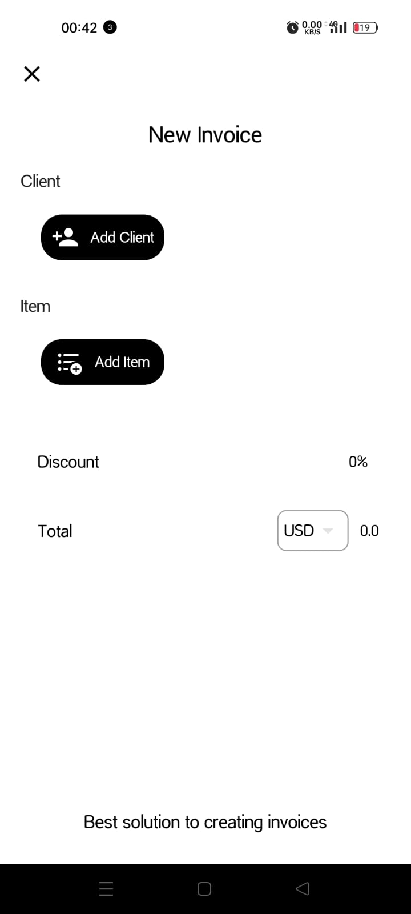
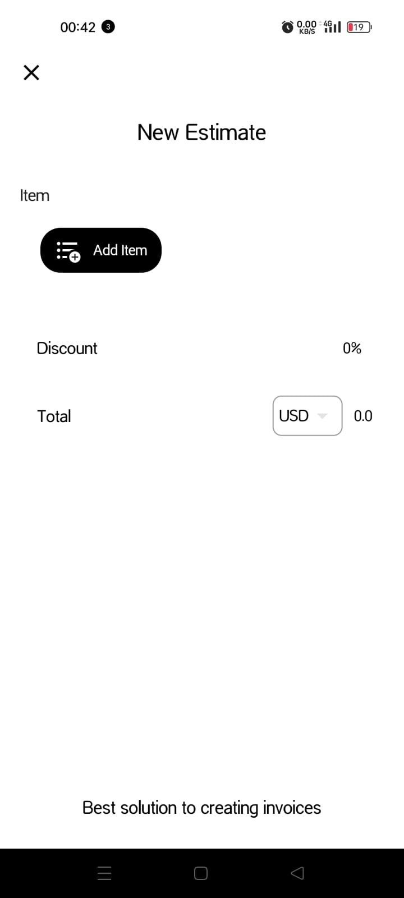
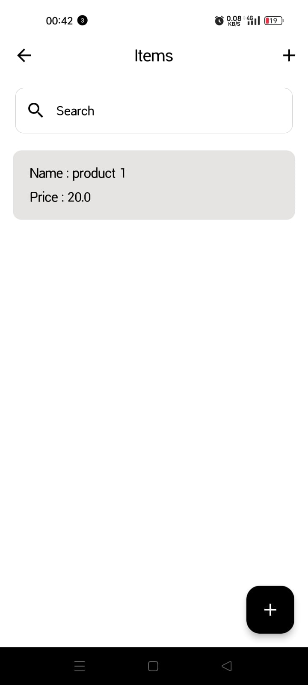
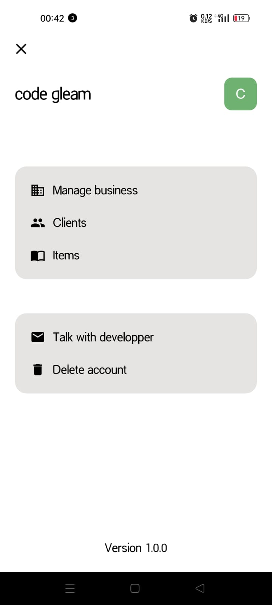
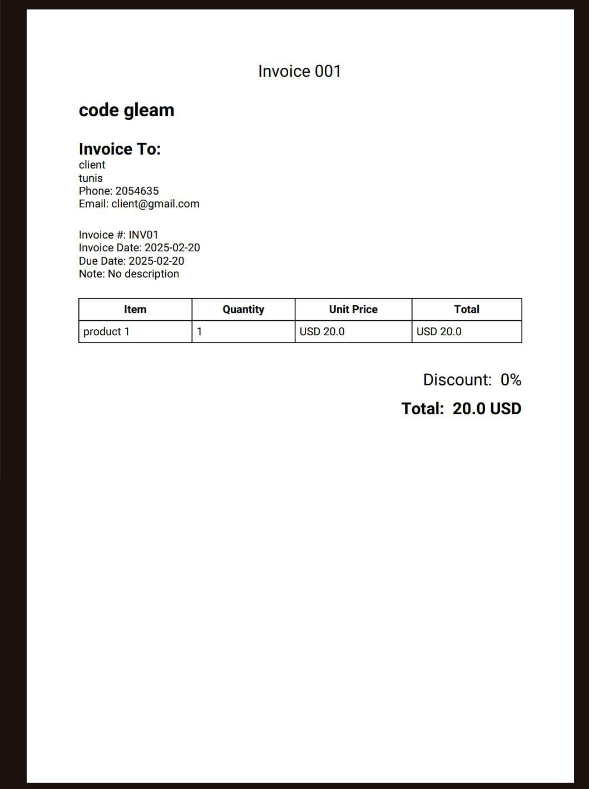

# quick_invoice

A **Flutter** mobile application for creating invoices and estimates, with PDF generation support. The app is built using **Hiver** as a local database and **GetX** for state management, ensuring a smooth and responsive user experience.

## 🚀 Features
- Create and manage invoices and estimates.
- Generate **PDF** versions of invoices and estimates.
- Store data locally using **Hiver** database.
- Efficient **state management** with **GetX**.
- Fully **responsive** design for different screen sizes.

## 🛠️ Tech Stack
- **Framework:** Flutter
- **State Management:** GetX
- **Local Database:** Hiver
- **PDF Generation:** Flutter PDF
- **UI Design:** Material Design

## 📸 Screenshots

## 📸 Screenshots

<table>
  <tr>
    <td align="center"><b>Create Business</b></td>
    <td align="center"><b>New Invoice</b></td>
  </tr>
  <tr>
    <td></td>
    <td></td>
  </tr>
  <tr>
    <td align="center"><b>New Estimate</b></td>
    <td align="center"><b>Items Page</b></td>
  </tr>
  <tr>
    <td></td>
    <td></td>
  </tr>
  <tr>
    <td align="center"><b>Client Page</b></td>
    <td align="center"><b>Profile Page</b></td>
  </tr>
  <tr>
    <td></td>
    <td></td>
  </tr>
  <tr>
    <td align="center" colspan="2"><b>Generated PDF</b></td>
  </tr>
  <tr>
    <td colspan="2" align="center"></td>
  </tr>
</table>

## 📦 Installation

# Clone the repository
git clone https://github.com/yourusername/invoice-estimate-app.git
cd invoice-estimate-app

# Install dependencies
flutter pub get

# Run the application
flutter run
